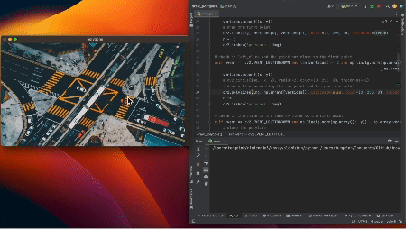

# Draw Polygons on an Image

## Inspirations

The goal of this project is to streamline the process of targeting specific regions in images. Users can effortlessly create polygons with a mouse, selecting vertices through clicks. This feature enhances computer vision and machine learning projects dedicated to focusing on specific areas within an image.

